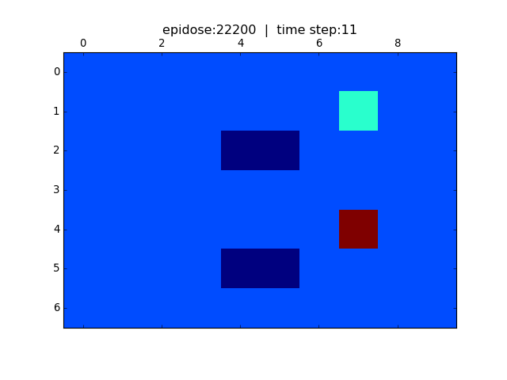

# Windy World
> An Example of Reinforcement Learning for 
> Making Decision Under Uncertainty

[![NPM Version][npm-image]][npm-url]
[![Build Status][travis-image]][travis-url]
[![Downloads Stats][npm-downloads]][npm-url]

Windy World is a classic problem for many reinforcement learning and dynamic programming methods. The idea is that an agent is moving in a grid world (7x10 in this example). There   are a starting cell, target (or home) cell and a few failing cells (lakes). The agent starts from the starting cell and must find its way to the home cell. In a calm world (no wind), the agent using a simple RL algorithm (in this case SARSA algorithm) can find its optimum way. The optimum way in this example is the shortest and the safest way.
But, to add uncertainty, the world is not a calm world, but a windy world. Technically, the agent choose an action, but due to the strong wind, the agent action is not necessarily the same as its choice. Therefore, the agent might fall into the lakes (failing cells). In this situation, the optimum path is not the shortest one any more. The agent must find an optimum safe and short path to get to the home cell.

## Running the Code
To run this code, please use Jupyter Notebook and run "Windy_World_stochastic.ipynb".